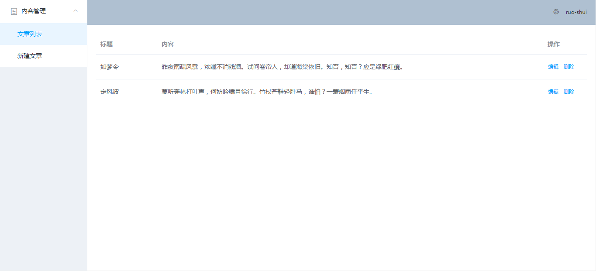
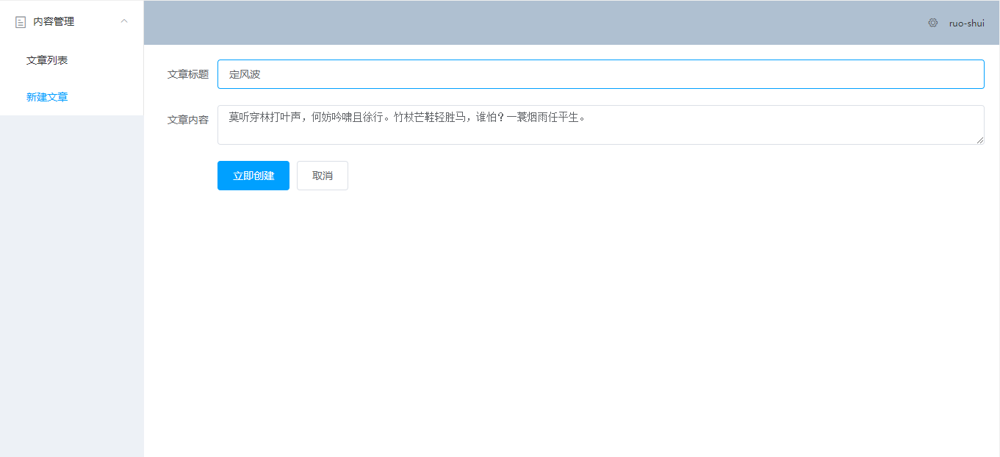

### 项目介绍

本项目是一个基于vue + element-ui + node.js(express) + mongodb的全栈后台管理系统，属于入门级别项目。麻雀虽小，五脏俱全。虽然比较简单，但是包含了最基本的增删改查和数据的展示。使初学者可以感受到全栈开发的魅力。

### 技术栈

vue + element-ui + node.js(express) + mongodb(mongoose) + axios

### 项目运行

需要安装node, mongodb, nodemon

服务端启动

```shell
cd server
npm run serve
```

客户端启动

```shell
cd admin
npm run serve
```

### 界面展示

<div>
    
    <br></br>
    
</div>

### 遇到的一些小问题

1.element-ui的菜单栏重复点击控制台会报错

解决方法：在new VueRouter之前加上以下代码

```js
const originalPush = VueRouter.prototype.push
VueRouter.prototype.push = function push(location) {
  return originalPush.call(this, location).catch(err => err)
}
```

2.使用webStorm编写express和mongoose相关代码时，没有智能提示。

解决方法：安装以下依赖

```shell
npm i -D @types/express
npm i -D @types/mongoose
```


